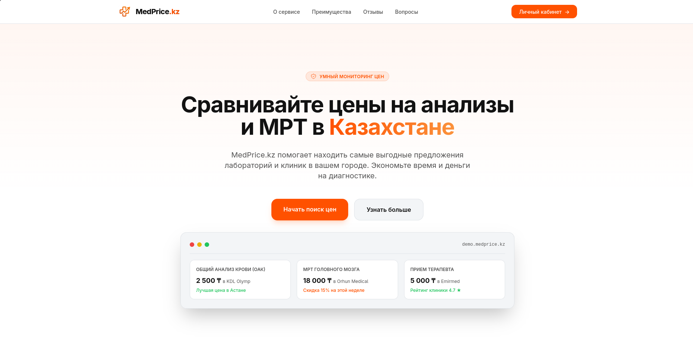

# 🩺 MedPrice.kz — Панель сравнения цен на медицинские услуги (Frontend)

Удобный, быстрый и отзывчивый интерфейс для мониторинга цен на медицинские услуги в клиниках и лабораториях Казахстана. Проект оптимизирован для работы на любых устройствах, поддерживает локализацию на 3 языка (RU, KK, EN) и оснащен интерактивными инструментами аналитики.

---

## 📸 Скриншот интерфейса

*(Скриншот главной страницы/панели аналитики)*

---

## 🛠️ Технологический стек

* **Фреймворк:** React 18 + TypeScript + Vite (быстрая сборка и HMR)
* **Стилизация:** Tailwind CSS
* **Состояние и Запросы:** React Query (TanStack Query)
* **Маршрутизация:** React Router DOM (с разделением кода / Lazy Loading)
* **Аналитика:** Recharts (адаптивные графики)
* **Локализация:** i18next (Русский, Қазақша, English)

---

## 🚀 Быстрый запуск

### 1. Требования
Убедитесь, что у вас установлен Node.js (версии 18 и выше) и менеджер пакетов `pnpm` (или `npm` / `yarn`).

### 2. Установка зависимостей
Установите библиотеки проекта:
```bash
pnpm install
```
*(Или `npm install` / `yarn install`)*

### 3. Запуск сервера разработки
Запустите локальный dev-сервер:
```bash
pnpm run dev
```
По умолчанию приложение запустится на [http://localhost:5173](http://localhost:5173) (или на порту 5174, если 5173 занят).

### 4. Сборка для продакшена
Скомпилируйте оптимизированный код для развертывания:
```bash
pnpm run build
```
Собранные оптимизированные файлы будут находиться в папке `dist/`.

---

## 🌐 Демонстрация через Ngrok

Чтобы показать проект другу или жюри напрямую со своего компьютера:

1. Запустите dev-сервер:
   ```bash
   pnpm run dev
   ```
   *(Обратите внимание на порт в консоли, например: `http://localhost:5174`)*
2. Запустите туннель на этом порту:
   ```bash
   ngrok http 5174
   ```
3. Скопируйте публичную ссылку вида `https://xxxx.ngrok-free.app` и отправьте её.

---

## 📂 Структура проекта

* `src/components/` — Переиспользуемые элементы интерфейса (включая кастомную SVG-карту `ClinicsMap`).
* `src/pages/` — Страницы (загружаются лениво через `React.lazy` для экономии трафика).
* `src/context/` — Состояние авторизации (`AuthContext`).
* `src/i18n/` — Языковые файлы локализации.
* `public/` — Статические ресурсы (логотип `logo.png`, фавикон, иконки).
